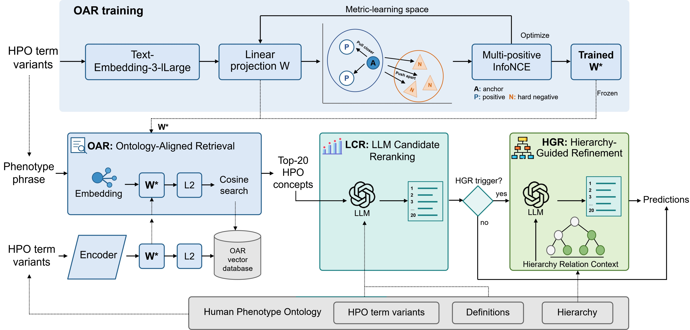

<h1 align="center">OntologyAligner</h1>

<p align="center">
  <strong>Ontology-Aligned Retrieval and Hierarchy-Guided Large Language Model Reranking<br>for Biomedical Ontology Normalization</strong>
</p>


<p align="center">
  <a href="LICENSE"></a>
  
  
  
  
</p>

<p align="center">
  <a href="#overview">&#129516; Overview</a> &nbsp;&middot;&nbsp;
  <a href="#phenonormbench">&#129514; PhenoNormBench</a> &nbsp;&middot;&nbsp;
  <a href="#quick-start">&#128640; Quick Start</a> &nbsp;&middot;&nbsp;
  <a href="#reproduction">&#128300; Reproduction</a> &nbsp;&middot;&nbsp;
  <a href="#citation">&#128214; Citation</a>
</p>

---

## Overview

**OntologyAligner** maps free-text biomedical phenotype expressions to standardized Human Phenotype Ontology (HPO) concepts. The framework combines ontology-specific representation learning, semantic candidate comparison, and explicit local hierarchy evidence in a traceable three-stage pipeline.

This repository provides the official implementation and data release for:

> **OntologyAligner: Ontology-Aligned Retrieval and Hierarchy-Guided Large Language Model Reranking for Biomedical Ontology Normalization**

<div align="center">
  
  <br>
  <sub><strong>OntologyAligner framework.</strong> OAR retrieves ontology-aligned candidates, LCR performs semantic reranking, and HGR selectively resolves local hierarchy conflicts.</sub>
</div>

<br>

| **OAR** | **LCR** | **HGR** |
| :---: | :---: | :---: |
| Ontology-Aligned Retrieval | LLM Candidate Reranking | Hierarchy-Guided Refinement |
| Learns a bias-free projection with concept-level multi-positive InfoNCE and retrieves Top-20 HPO candidates. | Compares preferred labels, synonyms, and definitions to produce a complete semantic ranking. May return `No Match`. | Uses explicit parent-child and sibling evidence when OAR and LCR disagree. Returns a complete ranking. |

> **13,390 phenotype mentions** &nbsp;|&nbsp; **7 HPO datasets** &nbsp;|&nbsp; **Top-20 candidate retrieval** &nbsp;|&nbsp; **Selective hierarchy refinement**

## What's Included

| Resource | Contents |
| --- | --- |
| &#128451;&#65039; **PhenoNormBench** | Seven standardized HPO normalization datasets and a fixed 2,100-sample ablation subset. |
| &#129516; **HPO snapshot** | OBO, JSON, and JSONL representations of the HPO release used by the workflow. |
| &#127919; **OAR** | Trained projection weights in `models/oar_projection.pt`, inference runtime, and local vector-index construction code. |
| &#129504; **LCR and HGR** | Complete prompts, response validation, checkpointing, and hierarchy-guided reranking logic. |
| &#129514; **Experiments** | Main seven-dataset runner plus component and sensitivity ablations. |
| &#128211; **Notebooks** | A two-step workflow for OAR precomputation followed by LCR and HGR. |

<details>
<summary><strong>Repository structure</strong></summary>

```text
.
|-- README.md
|-- LICENSE
|-- requirements.txt
|-- LLM_config.example.json
|-- 01_run_precompute.ipynb          # OAR retrieval and Top-20 precomputation
|-- 02_run_LLM_rerank.ipynb          # LCR and selective HGR reranking
|-- run_main_experiment.py           # Seven-dataset experiment runner
|-- run_ablation.py                  # Ablation entry point
|-- ontology_aligner_runtime.py      # Shared workflow runtime
|-- ontology_aligner_oar.py          # Formal TE3L OAR inference
|-- models/oar_projection.pt         # Trained OAR projection weights
|-- dataset_utils.py                 # Dataset and HPO ID utilities
|-- test_main_experiment_contract.py # Workflow contract tests
|-- ablation/
|   |-- config.py
|   |-- experiments.py
|   |-- oar.py                       # OAR training implementation
|   |-- runtime.py
|   `-- report.py
|-- Dataset/
|   |-- Ablation_Subset/
|   |-- BC8_T3/
|   |-- CSC/
|   |-- FGDD/
|   |-- GeneReviews-10/
|   |-- GSC2017/
|   |-- GSC2024/
|   `-- ID-68/
|-- HPO/
|   |-- hp260623.obo
|   |-- hp260623.json
|   |-- hp260623.jsonl
|   `-- convert_obo.py
`-- imgs/
    `-- ontologyaligner.jpg
```

</details>

## PhenoNormBench

PhenoNormBench unifies seven HPO normalization datasets into a common mention-level format.

PhenoNormBench is also available on [Hugging Face](https://huggingface.co/datasets/songjie0209/PhenoNormBench) and can be loaded as follows:
```python
from datasets import load_dataset

dataset = load_dataset("songjie0209/PhenoNormBench")
test = dataset["test"]
fgdd = test.filter(lambda example: example["dataset"] == "FGDD")
```

| Dataset | Mentions | Workbook |
| --- | ---: | --- |
| GeneReviews-10 | 352 | `Dataset/GeneReviews-10/GeneReviews-10.xlsx` |
| ID-68 | 866 | `Dataset/ID-68/ID-68.xlsx` |
| GSC2017 | 2,773 | `Dataset/GSC2017/GSC2017.xlsx` |
| GSC2024 | 2,910 | `Dataset/GSC2024/GSC2024.xlsx` |
| CSC | 1,783 | `Dataset/CSC/CSC.xlsx` |
| FGDD | 1,866 | `Dataset/FGDD/FGDD_Phenotype_Testset.xlsx` |
| BC8-T3 | 2,840 | `Dataset/BC8_T3/BC8_T3.xlsx` |
| **Total** | **13,390** | |

### Data fields

| Field | Description |
| --- | --- |
| `Raw_Phenotype_Names` | Original free-text phenotype mention used as model input. |
| `Standard_Phenotype_Names` | Standardized phenotype name. |
| `HPO_id` | Reference HPO identifier. |
| `Accepted_HPO_ids` | Accepted current or historical HPO identifiers used for evaluation. |
| `Patient_ID`, `patient_ids`, `pmids` | Source metadata when available. |

The fixed subset at `Dataset/Ablation_Subset/ablation_subset_seed42.xlsx` contains 300 samples from each dataset, giving 2,100 samples for the sensitivity analyses.

## Quick Start

### 1. Create the environment

```bash
cd OntologyAligner
conda create -n ontologyaligner python=3.10
conda activate ontologyaligner
python -m pip install -r requirements.txt
```

A CUDA-capable GPU is recommended for the E5 ablation training and local transformer backbones. The main workflow uses the included OAR weights.

### 2. Configure API access

```bash
cp LLM_config.example.json LLM_config.json
```

Windows PowerShell:

```powershell
Copy-Item LLM_config.example.json LLM_config.json
```

Set the model names, API endpoints, keys, and concurrency limits in `LLM_config.json`. The primary workflow reads `embedding` for TE3L embeddings and `llm` for LCR and HGR.


### 3. Choose a workflow

| Workflow | Entry point | Purpose |
| --- | --- | --- |
| &#128211; **Notebook** | `01_run_precompute.ipynb` then `02_run_LLM_rerank.ipynb` | Interactive, step-by-step execution. |
| &#9000;&#65039; **Command line** | `run_main_experiment.py` | Reproduce one dataset or all seven datasets. |
| &#129514; **Ablation** | `run_ablation.py` | Run component and sensitivity experiments. |

## Reproduction

### Notebook workflow

1. Open `01_run_precompute.ipynb` and configure the dataset and embedding settings.
2. Run the precompute cell. It creates the local OAR index when needed and generates the Top-20 candidate workbook.
3. Open `02_run_LLM_rerank.ipynb` and configure the dataset and LLM settings.
4. Run LCR and selective HGR to generate the final reranking workbooks.

The complete LCR and HGR prompts live in `02_run_LLM_rerank.ipynb`. The command-line runtime reads those definitions directly, keeping both workflows synchronized. Both notebooks use the same Python workflow as the command-line runner.

### Command-line workflow

Build or resume the local OAR index without running a dataset:

```bash
python run_main_experiment.py --prepare-only
```

Use `--rebuild-index` with this command when the local index needs to be rebuilt. This removes only the local OAR collection; its cached surface embeddings are reused.

Run one dataset:

```bash
python run_main_experiment.py \
  --dataset fgdd \
  --max-concurrency 10 \
  --requests-per-minute 200
```

Run the complete benchmark:

```bash
python run_main_experiment.py \
  --dataset all \
  --max-concurrency 10 \
  --requests-per-minute 200
```

Supported dataset keys:

```text
genereviews-10  id-68  gsc2017  gsc2024  csc  fgdd  bc8_t3
```

## Ablation Experiments

The ablation runner uses the current LLM model's main-stage results and generates any missing datasets first. It also builds missing raw HPO indexes locally; E5 local backbones are downloaded on first use. Starting an ablation from a fresh clone can therefore run the full main benchmark and incur its API costs.

| Experiment | Evaluation |
| :---: | --- |
| **E1** | Raw TE3L retrieval followed by LCR and HGR. |
| **E2** | OAR only. |
| **E3** | OAR followed by LCR. |
| **E4** | LLM-backbone sensitivity. |
| **E5** | Embedding-backbone and OAR sensitivity. |
| **E6** | Candidate-set size: `k = 1, 3, 5, 10, 20`. |

```bash
# Run one experiment
python run_ablation.py --experiment E3

# Select an LLM or embedding backbone
python run_ablation.py --experiment E4 --llm-backbone claude-opus-5
python run_ablation.py --experiment E5 --backbone text_embedding_3_large

# Run the full configured protocol
python run_ablation.py --all
```

## Testing

```bash
python -m pytest test_main_experiment_contract.py -q
```

The contract tests cover the shared Top-20 workflow, dataset/workbook interfaces, and the LCR/HGR `No Match` policy.

## Citation

The manuscript is currently under review. 

## License

This repository is released under the [MIT License](LICENSE).

## Contact

For technical questions, please open an issue or contact:

- Song Jie: <songjie02_09@163.com>
